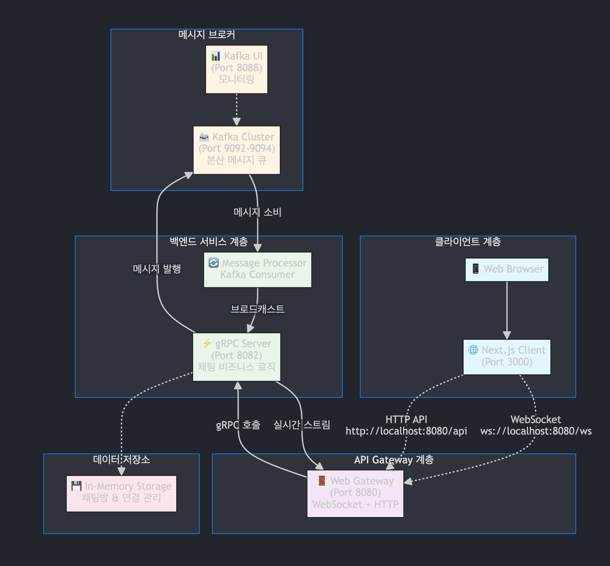
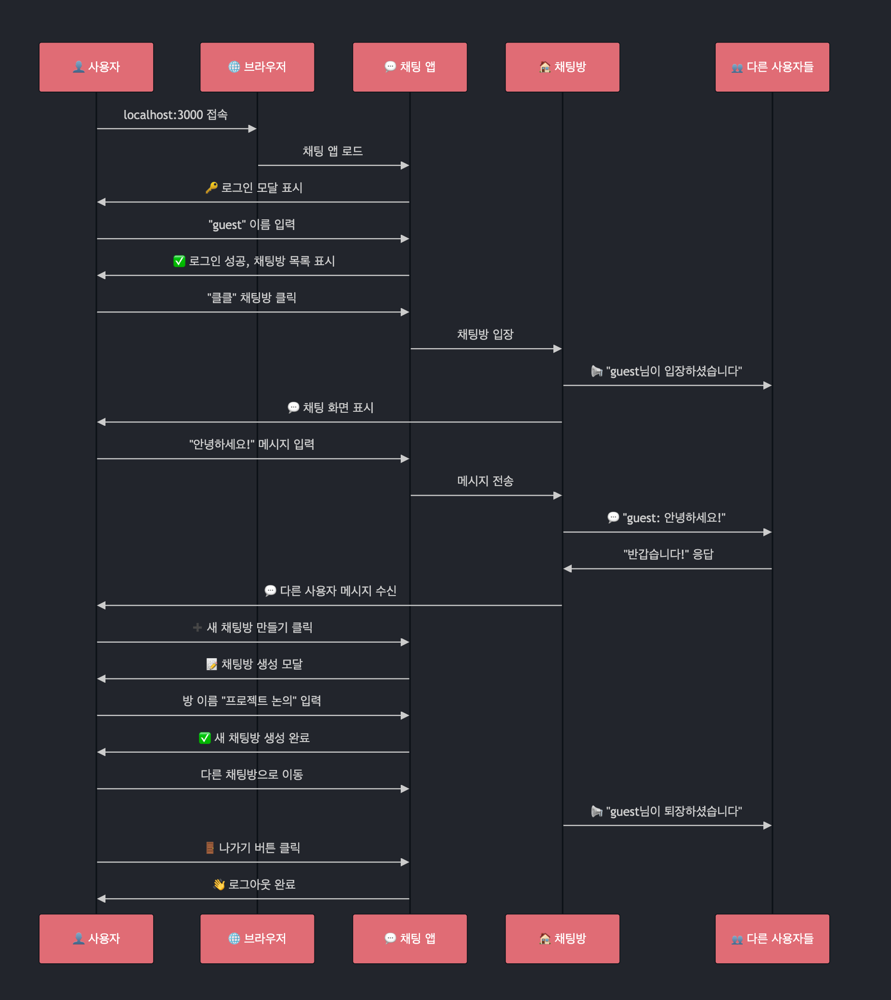
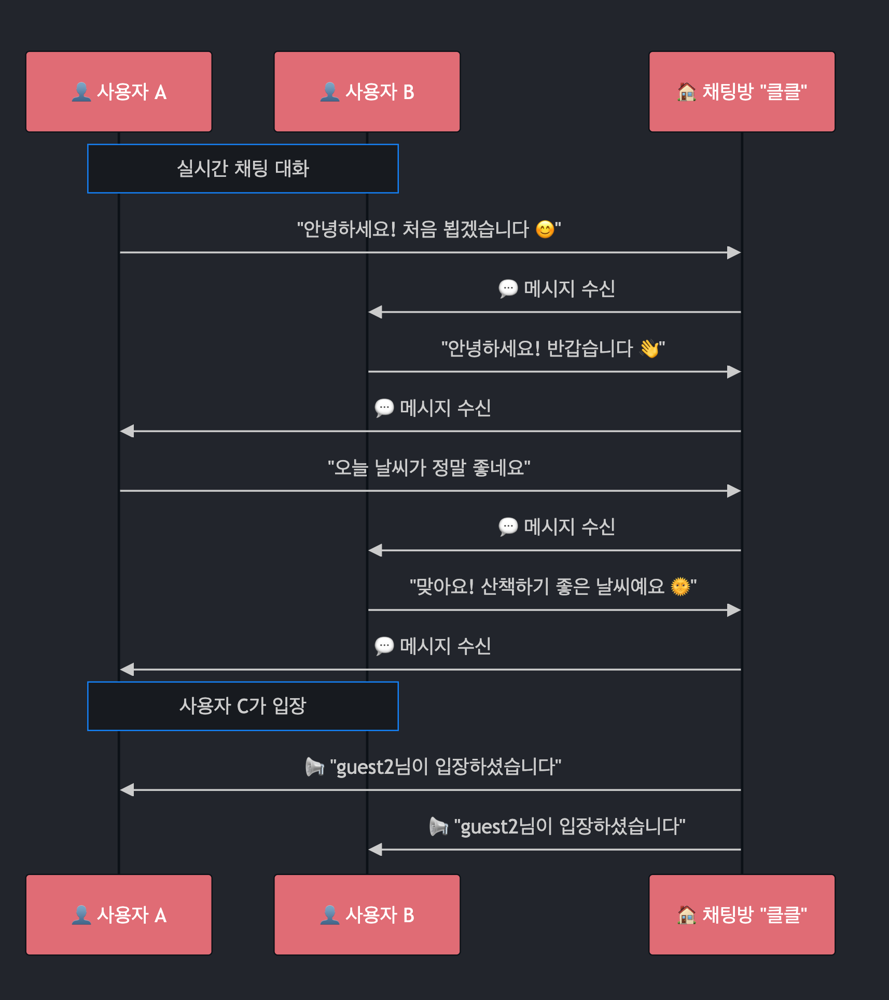
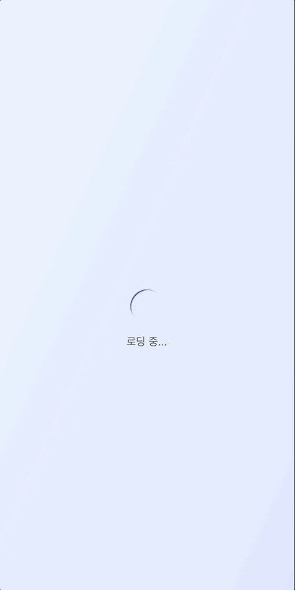
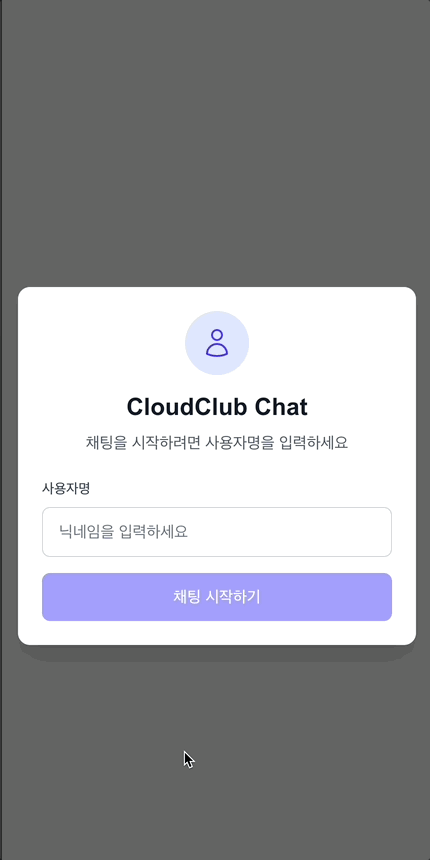
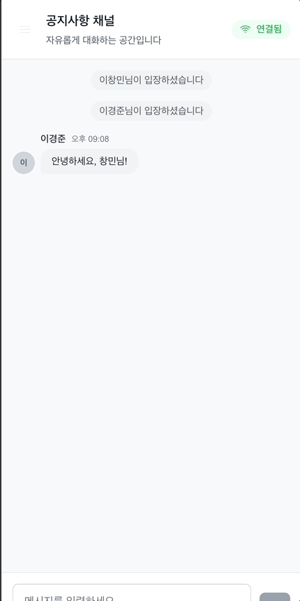

# CloudClub Chat

Go + gRPC + Kafka + Next.js로 구현된 실시간 채팅 시스템입니다.

## 🏛️ 시스템 아키텍처

```
┌─────────────────┐    WebSocket     ┌─────────────────┐
│   Next.js       │◄────────────────►│  Web Gateway    │
│   Client        │                  │  (Go Server)    │
│  (Port 3000)    │                  │  (Port 8080)    │
└─────────────────┘                  └─────────────────┘
                                             │ gRPC
                                             ▼
┌─────────────────┐    Kafka         ┌─────────────────┐
│  Message        │◄────────────────►│   gRPC Server   │
│  Processor      │                  │   (Port 8082)   │
│  (Consumer)     │                  └─────────────────┘
└─────────────────┘                           │
         ▲                                    │
         │                                    ▼
┌─────────────────┐                  ┌─────────────────┐
│     Kafka       │                  │   Chat Rooms    │
│   Cluster       │                  │   & Messages    │
│ (Port 9092-94)  │                  │   (In-Memory)   │
└─────────────────┘                  └─────────────────┘
```



## 👨 사용자 플로우



## 💬 채팅 플로우



### 채팅 서비스 진입 (사용자 1 - 이창민)



### 채팅방 진입 및 채팅 입력 (사용자 2 - 이경준)



### 채팅 입력 및 채팅방 확인



## 📁 프로젝트 구조

```
go-grpc/
├── server/          # Go 백엔드
│   ├── cmd/server/  # 메인 애플리케이션
│   ├── internal/    # 내부 비즈니스 로직
│   ├── api/proto/   # gRPC 프로토콜 정의
│   └── pkg/gen/     # 생성된 protobuf 코드
├── client/          # Next.js 프론트엔드
│   ├── src/
│   │   ├── components/  # React 컴포넌트
│   │   ├── hooks/       # 커스텀 훅
│   │   └── types/       # TypeScript 타입
└── infra/           # Docker 인프라 설정
    └── docker-compose.yml
```

## 🔧 개발 가이드

### 환경 요구사항

- **Go**: 1.21 이상
- **Node.js**: 18 이상
- **Docker**: 20 이상
- **Make**: 3.8 이상
- **Protocol Buffers**: 3.21 이상

### 주요 기능

- ✅ 실시간 채팅 (WebSocket)
- ✅ 다중 채팅방 지원
- ✅ 사용자 입장/퇴장 알림
- ✅ 분산 메시지 처리 (Kafka)
- ✅ 반응형 UI (모바일/데스크톱)
- ✅ 자동 재연결

## 🚦 포트 정보

| 서비스         | 포트 | 설명                  |
| -------------- | ---- | --------------------- |
| Next.js Client | 3000 | React 개발 서버       |
| Web Gateway    | 8080 | WebSocket + HTTP API  |
| gRPC Server    | 8082 | 내부 gRPC 통신        |
| Kafka UI       | 8088 | Kafka 관리 인터페이스 |
| Kafka Broker 1 | 9092 | Kafka 클러스터        |
| Kafka Broker 2 | 9093 | Kafka 클러스터        |
| Kafka Broker 3 | 9094 | Kafka 클러스터        |

## 📝 접속 방법

1. **웹 채팅**: http://localhost:3000
2. **Kafka 모니터링**: http://localhost:8088
