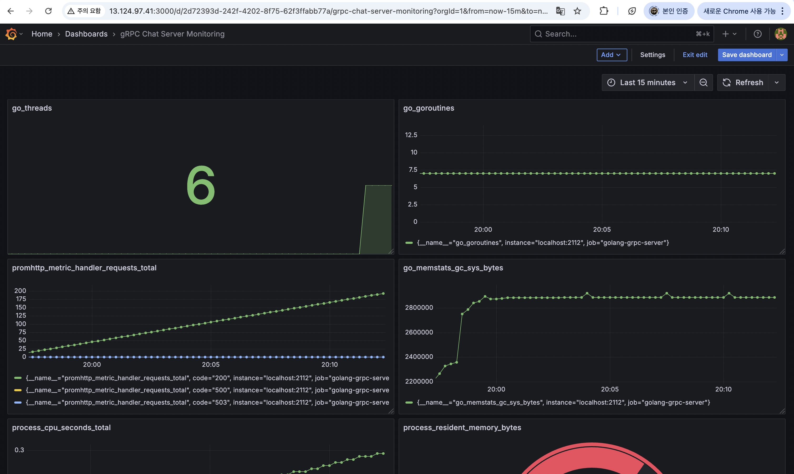

## 시스템 구조 (추가 예정)

## 시연 영상

## 모니터링 (수정 필요)

- go_goroutines: 현재 실행 중인 고루틴 수
- go_memstats_alloc_bytes: 현재 사용 중인 heap 메모리
- process_cpu_seconds_total: 전체 CPU 사용 시간
- go_threads: 생성된 OS-level 쓰레드 수
- process_resident_memory_bytes: 실제 사용 중인 메모리 (RSS)

---

## 환경 요구 사항

| 항목 | 버전 / 조건 |
|------|--------------|
| Node.js | ≥ 18.x |
| npm | ≥ 9.x |
| Go | ≥ 1.20 |
| React | ≥ 18 |
| Protocol Buffers (protoc) | ≥ 3.20 |
| Make (선택)  | GNU Make ≥ 4.0     |

 

---

## 주요 기능

- ✅ 실시간 채팅 (WebSocket)
- ✅ gRPC 기반 양방향 메시지 스트리밍 처리
- ✅ WebSocket ↔ gRPC 중계 프록시 서버
- ✅ Prometheus + Grafana를 활용한 성능 모니터링

 

---

## 포트 구성

| 구성 요소          | 설명                          | 포트   |
|-------------------|-------------------------------|--------|
| React 프론트엔드   | 채팅 UI                        | 3000   |
| WebSocket Proxy   | Web → gRPC 중계 서버           | 8080   |
| gRPC 서버         | 채팅 처리용 Go 서버            | 50051  |
| Prometheus        | 모니터링 수집기                | 9090   |
| Grafana           | 시각화 대시보드                | 4000   |
| gRPC 서버 metrics | /metrics 엔드포인트 제공       | 2112   |

---

